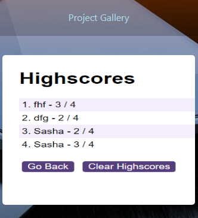
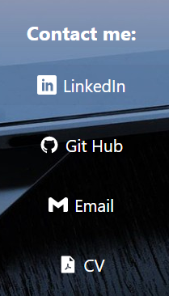
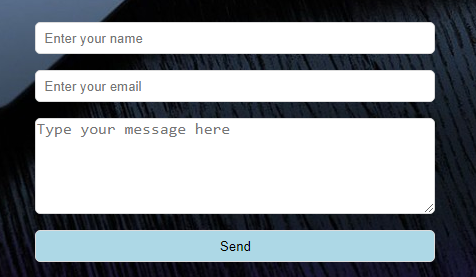

# React-Portfolio
Creating portfolio (SPA application) using React library, React Router.

## Description
This Project's aim was to build a Single Page Appliation and present it as a Portfolio created using React library. This kind of Portfolio is called upgraded in comparison with previous ones. React was easier to work with in this Project. The SPA contains 3 pages: Home, Project Gallery and Contact.  Home page includes name, avatar and brand statement. Project Gallery is a set of projects (experience). Contact information can be found on the Contact page. 
In this Portfolio I applied my knowledges of React basics and also used React Router to implement routing in the application. It was a little bit of a challange to set up all the projects in the right way with all the links as I was using custom CSS, not Bootstarp.

## Instalation
N/A

## Usage
As it was mentioned before the Portfolio has 3 pages rendering from different components. Navbar is rendered throughout the application. Home page is a static page. 

The Project Gallery shows some of the finished projects as an image. But when actually hover on it you can see it's name, GitHub link and deployed link, where you can find out more about the specific project. 

Any contact info like GitHub, LinkedIn profile, email can be found on the Contact page. CV is avaliable to download. 

A contact form at the bottom of the page allows to contact me by entering your name, email and message or question you want to ask. 

## Credits
N/A

## License
Please refer to the LICENSE in the repo.

